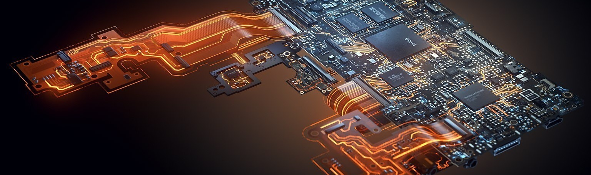

# Altium Components Library

The **Altium Components Library** is my personal collection of electronic components designed for use in Altium Designer and should not be taken as a reliable source. 
<!-- This library is intended to ...-->

## Contents

- [Features](#features)
- [Requirements](#requirements)
- [Installation](#installation)
- [Usage](#usage)
- [Contribution](#contribution)
- [License](#license)

## Features
- Wow such good practices
<!--
- A wide selection of electronic components, including resistors, capacitors, microcontrollers, etc.
- Detailed documentation for each component, including datasheets and usage examples.
- Compatibility with specific versions of Altium Designer.
-->

## Requirements

- Altium Designer (version [23.8.1] or greater)
<!--
- Other specific requirements for your library (if any)
-->

## Installation

1. Clone this repository on your local system

2. Ta pelao

## Usage 

1. Open the .LibPkg with Altium Designer

2. Compile the .LibPkg and generate the .IntLib

3. Do hardware stuff

## Contribution

If you wish to contribute to the Altium Components Library, gracias pero no gracias, toy ocupao.